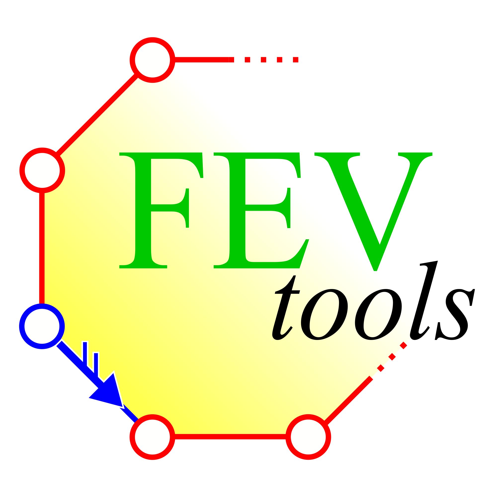

# FEV-tools

Fortran-written collection of tools to work with embedding tensors representing 3-regular graphs (analogous to 2D nanocarbon structures made solely of tricoordinated atoms). 

It deals with a simple .fev format for the tensor and with the related .flg format for the flag graph describing the 3-regular graphs.

The following tools perform simple conversions for the .fev and .flg, formats:
- fev2flg - embedding-tensor to flag-graph
- flg2fev - flag-graph to embedding-tensor
- for2bin - binary from/to formatted conversion
    
In addition, the following tools perform specific tasks:
- fev2pov - tensor illustration 
- fev2sum - sum rules computation
- flg2iso - isomorphism check
- flg2pri - reduction to the primitive cell
- flg2svg - flag-graph illustration
- flg2sym - symmetry check
- flg2gen - structure generation 
- flg2smb - polygonal symbol generation
- flg2xyz - coordinates generation
- flg4xyz - files generation from coordinates

The package consists of a Src folder with the source code files and a makefile. It also includes a Doc folder with the user guide and an Examples folder containing the .fev files of a few illustrative structures (along with the corresponding files for the coordinates and lattice vectors).

This software was initially written to implement the theory developed by the team in the following paper:
- npj Computational Materials 12, 65 (2026). DOI: 10.1038/s41524-025-01932-8

Along with the Fortran code, the team also developed a Python-based application for the same paper, listed in the article as reference [41], and available at:

https://github.com/acm3851/embedding_tensor

The team is formed by:
- Eduardo Costa Girão (who maintains the Fortran software);
- Lilac Macmillan (who maintains the Python software);
- Vincent Meunier (project manager).

